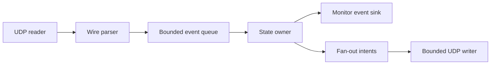
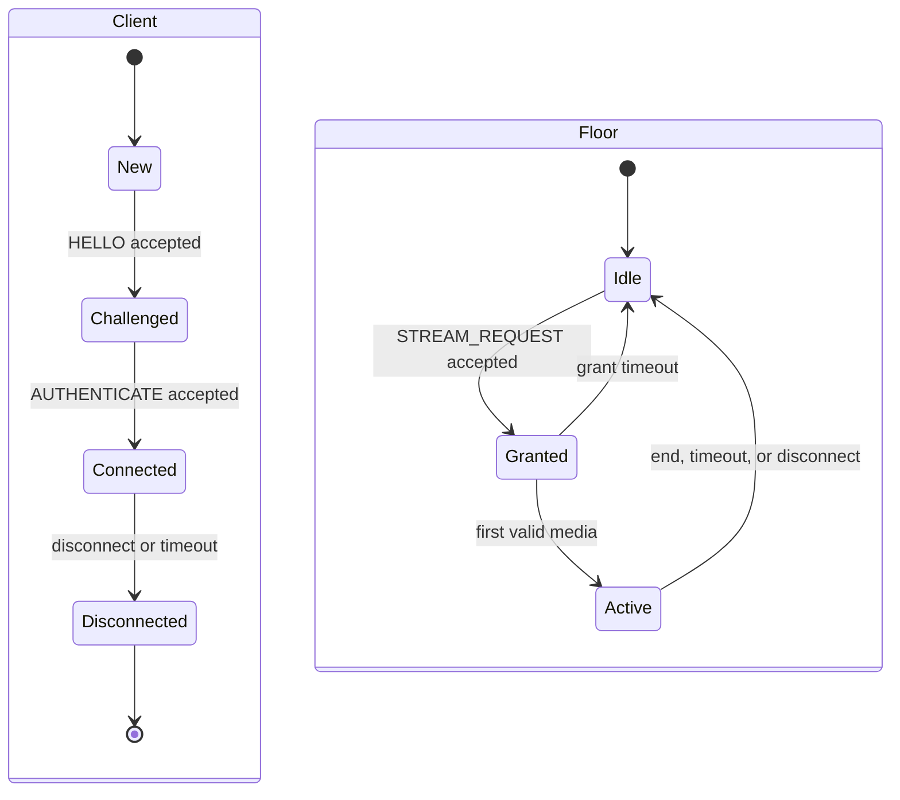

# OpusRef Server and Client Architecture

## 1. Design goals

The reflector moves opaque frames with low latency. It has one shared channel.
It permits one transmitting client at a time. It does not contain an audio
codec, jitter buffer, recorder, or radio interface.

The implementation applies SOLID principles. Protocol parsing, UDP transport,
session policy, floor policy, fan-out, configuration, and monitoring have
separate responsibilities. Interfaces stay small. Tests use injected clocks,
random sources, packet transports, and event sinks.

## 2. Repository boundaries

| Area | Responsibility |
|---|---|
| `pkg/wire` | Header and TLV encoding, decoding, validation, and golden vectors |
| `pkg/server` | Sessions, floor arbitration, stream state, and fan-out decisions |
| `pkg/client` | Handshake, retry, keepalive, floor control, and raw-frame events |
| `pkg/monitor` | Read-only snapshots, events, HTTP handlers, and metrics |
| `internal/config` | YAML load, defaults, validation, and secret resolution |
| `cmd/opusrefd` | Server composition, signals, and graceful shutdown |
| `cmd/opusrefctl` | Diagnostic client composition and length-delimited frame I/O |

No policy package reads or writes a UDP socket directly. No wire parser changes
server state. The command packages only compose dependencies.

## 3. Server data flow

One goroutine owns all session, transaction, challenge, and floor state. This
rule removes lock ordering from protocol policy. The UDP reader copies each
datagram into a bounded buffer and validates it before it creates an event. The
state owner does not block on network writes, logs, metrics, or HTTP clients.

One UDP writer receives immutable send intents. Its queue is bounded. When the
queue is full, the server drops the new media intent, increments a metric, and
continues. Control responses use a small reserved queue so that media load does
not block disconnect, revoke, or error traffic.

The server uses one UDP socket. A session key contains the random session ID and
the remote IP address and port. The session store has configured client and
challenge limits. Expiration uses an injected monotonic clock.

## 4. State model

Only the state owner can grant or release the floor. The first accepted
`STREAM_REQUEST` in event order wins. A duplicate transaction returns its prior
result. A second client receives `STREAM_BUSY`. A grant becomes active on the
first valid audio or data packet.

Release causes are owner end, owner disconnect, unused grant timeout, media
inactivity timeout, and transmit time limit. Each release produces one monitor
event and one listener revoke operation.

## 5. Client architecture

The client package accepts a packet transport, clock, random source, and event
sink. It owns one connection state machine and at most one local stream. It
performs control retries and keepalives. It exposes received stream metadata,
opaque audio, typed data, busy, revoke, and error events.

The library does not reorder, decode, or play audio. It reports sequence gaps
and timestamps so that an application can implement a jitter buffer. Send
methods accept a complete Opus packet or typed data payload. They reject a
payload that cannot fit in a 1,200-byte datagram.

`opusrefctl` reads and writes a diagnostic record format. Each record has a
four-byte network-order length followed by one opaque payload. The command can
connect, request the floor, send records from standard input, and write received
records to standard output. It does not use microphone or speaker devices.

## 6. Configuration and secrets

The server reads YAML once at startup. It validates all addresses, limits,
identifiers, and timer relationships before it opens a socket. Defaults match
`config.example.yaml`.

An environment variable has priority over a shared-key file. The server uses the
UTF-8 bytes of a nonempty environment value. If the environment variable is not
set or is empty, the server reads the configured file. It reads at most 65 bytes
and removes one final LF or CRLF line ending. The remaining key MUST contain 16
through 64 bytes. The server does not trim other bytes.

The key file MUST be a regular file. On a system that reports POSIX permission
bits, group and other permissions MUST be zero. The server refuses a file when
it cannot verify these restrictions. An operator on an unsupported file system
must use the environment variable. If neither source supplies a key, the server
uses open admission.

The key never enters a configuration snapshot, log field, error, metric, or
HTTP response.

## 7. Development method

Use TDD for each behavior. First, add a failing test. Then, add the minimum code
that makes the test pass. Finally, refactor while the tests stay green.

Start implementation in this order:

1. Wire value validation and golden byte vectors.
2. TLV parsing, malformed input tests, and fuzz tests.
3. Pure session and floor state machines with a fake clock.
4. Client and server control transactions with an in-memory packet transport.
5. UDP adapters and bounded writer queues.
6. Monitoring snapshots and handlers.
7. Command composition and interoperability tests.

Run unit tests with the race detector. Do not use a self-generated round trip as
the only wire test. Golden vectors must contain manually reviewed bytes.
