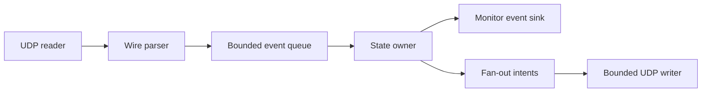
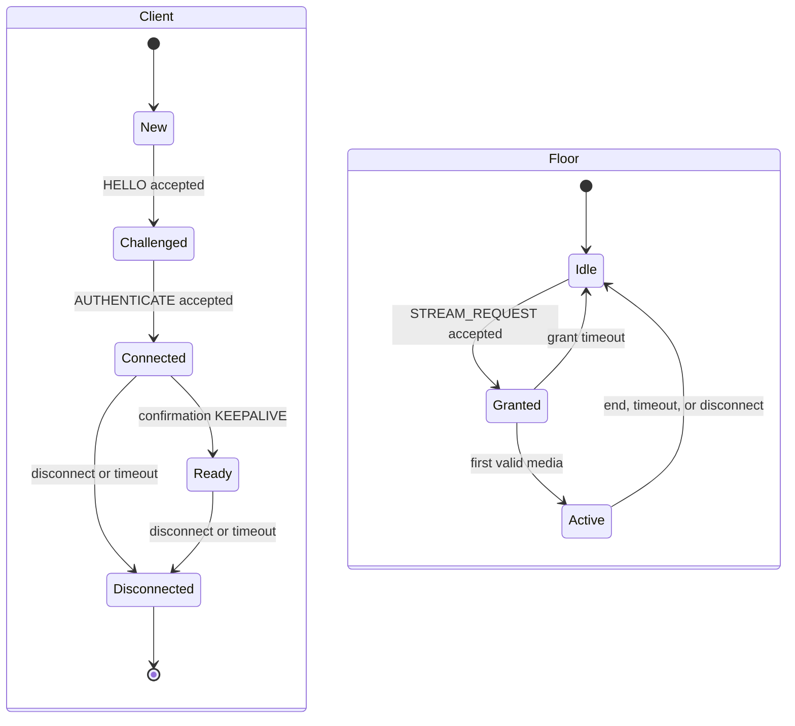
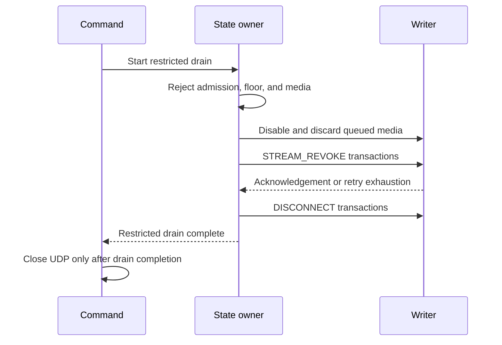

# OpusRef Server and Client Architecture

## 1. Design goals

The reflector moves opaque frames with low latency. It has one shared channel.
It permits one transmitting client at a time. It does not contain an audio
codec, jitter buffer, recorder, or radio interface.

The implementation applies SOLID principles. Protocol parsing, UDP transport,
session policy, floor policy, fan-out, configuration, and monitoring have
separate responsibilities. Interfaces stay small. Tests use injected clocks,
random sources, packet transports, and event sinks.

## 2. Repository boundaries

| Area | Responsibility |
|---|---|
| `pkg/wire` | Structural encoding, decoding, registered-value validation, and golden vectors |
| `pkg/server` | Sessions, floor arbitration, stream state, and fan-out decisions |
| `pkg/client` | Handshake, retry, keepalive, floor control, and raw-frame events |
| `pkg/monitor` | Read-only snapshots, events, HTTP handlers, and metrics |
| `internal/config` | YAML load, defaults, validation, and secret resolution |
| `cmd/opusrefd` | Server composition, signals, and graceful shutdown |
| `cmd/opusrefctl` | Diagnostic client composition and length-delimited frame I/O |

No policy package reads or writes a UDP socket directly. No wire parser changes
server state. The command packages only compose dependencies.

## 3. Server data flow

One goroutine owns all session, transaction, challenge, and floor state. This
rule removes lock ordering from protocol policy. The UDP reader copies each
datagram into a bounded buffer and validates it before it creates an event. The
state owner does not block on network writes, logs, metrics, or HTTP clients.

One UDP writer receives immutable send intents. Its queues are bounded. The
media queue has 256 frame batches. A batch contains one datagram and one
recipient snapshot. The control queue has 64 destination datagrams. The writer
sends available control traffic before each media batch and between recipient
writes. The state owner does not block on either queue.

The server uses one UDP socket. A session key contains the random session ID and
the remote IP address and port. The session store has configured client and
challenge limits. Expiration uses an injected monotonic clock.

The UDP reader uses a 1,201-byte detection buffer. It rejects a datagram that is
larger than 1,200 bytes. It does not accept a truncated prefix as a packet.

## 4. State model

Only the state owner can grant or release the floor. The first accepted
`STREAM_REQUEST` in event order wins. A duplicate transaction returns its prior
result. A second client receives `STREAM_BUSY`. A grant becomes active on the
first valid audio or data packet. The endpoint supplies each 48 kHz timestamp.
The reflector records and forwards the current header timestamp without
modification. It does not calculate an Opus duration. Audio and data use one
sequence space. A data packet can activate a granted stream.

Release causes are owner end, owner disconnect, unused grant timeout, media
inactivity timeout, and transmit time limit. Each release produces one monitor
event and one listener revoke operation.

## 5. Client architecture

The client package accepts an injected sender for unit tests. Its UDP adapter
owns the socket, secure random source, receive timer, and event sink. It owns one
connection state machine and at most one local stream. It
performs control retries and keepalives. It exposes received stream metadata,
opaque audio, typed data, busy, revoke, and error events.

The server uses a per-listener transaction for each stream-start and
stream-revoke notification. The listener acknowledges the notification. The
server retries an unacknowledged notification with the standard bounded retry
schedule. A new session does not enter the fan-out set until its immediate
post-welcome keepalive confirms the session ID.

The client waits for `STREAM_GRANT` before it activates its send state. It uses
the same transaction ID for attempts at 0, 0.5, 1.5, and 3.5 seconds. It rejects
a response with a different session ID, stream ID, packet type, or transaction
ID. It rejects overlapping floor requests. It advances sequence and timestamp
state only after it accepts a frame into the bounded send queue. It acknowledges
each notification retry and publishes one lifecycle event for the state change.
Before it sends `STREAM_END`, it waits until the transport has sent every
accepted media frame. This preserves media, sequence, and timestamp order.

`Close` sends a transactional `DISCONNECT` when the client has an active
session. It uses the control retry schedule and the configured operation
timeout. It closes the UDP socket after the response or timeout. A
server-initiated disconnect is acknowledged and closes the socket without
starting a second exchange. The public `Client` interface has nine methods. It
does not include a context-specific close method.

A correlated `ERROR` completes a pending request. The client publishes one
protocol-error event with the session ID, stream ID, error code, and optional
error text.

One connect attempt owns the pre-admission socket reader. The client rejects a
concurrent connect attempt. An unrelated datagram does not advance the retry
schedule. The library limits the full connection procedure to the configured
connect timeout or an earlier caller deadline. The reader continues until that
deadline.

The library does not reorder, decode, or play audio. It reports sequence gaps
and timestamps so that an application can implement a jitter buffer. Send
methods accept a complete Opus packet or typed data payload. They reject a
payload that cannot fit in a 1,200-byte datagram.

`opusrefctl` reads and writes the 16-byte `ORR1` diagnostic record header that
the protocol specification defines. It does not use microphone or speaker
devices.

### 5.1 Capacity and shutdown

The server permits 100 connected clients and 100 pending challenges. It uses a
256-datagram inbound queue. It retains 1,024 completed transactions globally
and 64 for each admitted session. It permits 200 pending notifications globally
and two for each listener. It retains 256 monitoring events.

The UDP client composes a socket reader with its configured bounded inbound
datagram queue. It drops a new datagram when this queue is full. If a required
lifecycle event cannot enter the application queue, the client closes its UDP
transport and reports a terminal error.

If the server cannot enqueue a required control response or a retained duplicate
response, it closes the admitted session. If that session owns the floor, the
server sends owner-disconnect revoke semantics to the listeners.

The receive state identity contains the owner session ID and stream ID. A
periodic receive-state timer uses the last-media time for that stream. Unrelated
socket traffic does not delay expiry.

## 6. Configuration and secrets

The server reads YAML once at startup. It validates all addresses, limits,
identifiers, and timer relationships before it opens a socket. Defaults match
`config.example.yaml`.
The server and client constructors reject zero or negative effective queue and
state capacities before they allocate channels. They reject negative timer
values instead of treating them as defaults.

The live reflector supplies one clock to the engine, challenges, retained
transactions, notification retries, session timeouts, and monitoring snapshots.
Tests replace this clock to control policy time.

An environment variable has priority over a shared-key file. The server uses the
UTF-8 bytes of a nonempty environment value. If the environment variable is not
set or is empty, the server reads the configured file. It reads at most 65 bytes
and removes one final LF or CRLF line ending. The remaining key MUST contain 16
through 64 bytes. The server does not trim other bytes.

The key file MUST be a regular file. On a system that reports POSIX permission
bits, group and other permissions MUST be zero. The server refuses a file when
it cannot verify these restrictions. An operator on an unsupported file system
must use the environment variable. If neither source supplies a key, the server
uses open admission.

The key never enters a configuration snapshot, log field, error, metric, or
HTTP response.

## 7. Development method

Use TDD for each behavior. First, add a failing test. Then, add the minimum code
that makes the test pass. Finally, refactor while the tests stay green.

Start implementation in this order:

1. Wire value validation and golden byte vectors.
2. TLV parsing, malformed input tests, and fuzz tests.
3. Pure session and floor state machines with a fake clock.
4. Client and server control transactions with an in-memory packet transport.
5. UDP adapters and bounded writer queues.
6. Monitoring snapshots and handlers.
7. Command composition and interoperability tests.

Run unit tests with the race detector. Do not use a self-generated round trip as
the only wire test. Golden vectors must contain manually reviewed bytes.
