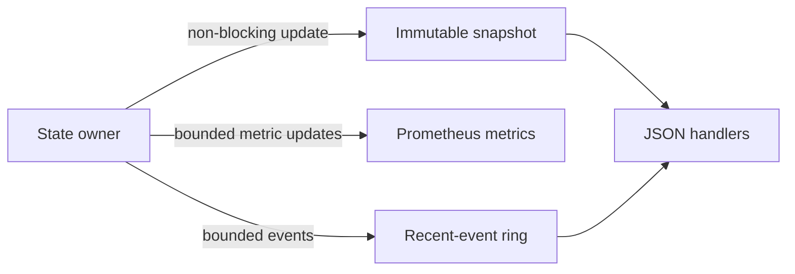

# OpusRef Monitoring Specification

## 1. Access and data lifetime

The monitoring server binds to `127.0.0.1:8080` by default. Version 1 does not
provide HTTP authentication. An operator must use a VPN or authenticated reverse
proxy before the operator exposes monitoring on another interface.

Monitoring is read-only. It does not change sessions or floor state. Current
state and recent events stay in memory. A restart clears them. The default event
capacity is 256. The server removes the oldest event when the buffer is full.

JSON can contain callsigns, reflector IDs, stream IDs, session IDs, and remote
addresses. Prometheus labels and metric names must not contain these values.

## 2. HTTP endpoints

All JSON endpoints use UTF-8, `application/json`, and a stable `api_version: 1`
field. Unknown JSON fields can be added in a compatible release.

| Endpoint | Successful result |
|---|---|
| `/healthz` | `200` when the process event loop responds; otherwise `503` |
| `/readyz` | `200` after UDP bind and state-loop start; otherwise `503` |
| `/api/v1/status` | Reflector identity, version, uptime, readiness, client count, and floor summary |
| `/api/v1/clients` | Connected node callsign, masked remote address, session ID, connect time, and last activity |
| `/api/v1/stream` | Idle state or owner/session/stream callsigns, start time, last frame time, and remaining transmit time |
| `/api/v1/events` | Newest-first bounded connection, authentication, stream, timeout, and error events |
| `/metrics` | Prometheus text exposition |

A remote address in JSON keeps the IP address but replaces the UDP port with
zero. The status API never returns nonces, authentication tags, key source
paths, or shared-key values.

## 3. Event model

Each event contains an event ID, UTC timestamp, event type, severity, and a
small set of typed details. Event IDs increase for the process lifetime. The
defined event types are `client_connected`, `client_disconnected`,
`authentication_failed`, `stream_granted`, `stream_busy`, `stream_active`,
`stream_ended`, `stream_timeout`, `transmit_time_limit`, `malformed_packet`,
`queue_drop`, and `control_overload`.

| Event type | Required details |
|---|---|
| `client_connected` | Session ID and node callsign |
| `client_disconnected` | Session ID, node callsign, and bounded reason |
| `authentication_failed` | None |
| `stream_granted` | Session ID and stream ID |
| `stream_busy` | None |
| `stream_active` | Session ID and stream ID |
| `stream_ended` | Session ID, stream ID, and end reason |
| `stream_timeout` | Session ID, stream ID, and grant or media-inactivity reason |
| `transmit_time_limit` | Session ID, stream ID, and transmit-time-limit reason |
| `malformed_packet` | None |
| `queue_drop` | Fixed queue, fixed item type, frame count, and recipient count |
| `control_overload` | Session ID |

The server emits `stream_active` for the first accepted media frame. Every
release emits `stream_ended`. A grant timeout or media-inactivity timeout also
emits `stream_timeout`. A transmit time limit also emits
`transmit_time_limit`. The server emits `client_disconnected` on each path that
removes a session. It emits `queue_drop` when it observes an inbound drop or
rejects queued media or control work.

The bounded disconnect reasons are `client_request`, `server_shutdown`,
`session_timeout`, `control_overload`, and
`admission_delivery_failure`.

An event must not contain media or typed-data payload bytes. Error text must not
contain secret material. Event details use bounded protocol identifiers, fixed
reason strings, fixed queue names, fixed item types, and integer counts. They do
not contain a shared key, nonce, authentication tag, or HMAC input.

## 4. Prometheus metrics

All names use the `opusref_` prefix. Counters have a `_total` suffix.

| Metric | Type | Labels |
|---|---|---|
| `opusref_up` | Gauge | None |
| `opusref_ready` | Gauge | None |
| `opusref_uptime_seconds` | Gauge | None |
| `opusref_sessions` | Gauge | None |
| `opusref_floor_active` | Gauge | None |
| `opusref_packets_total` | Counter | `direction`, `packet_type` |
| `opusref_bytes_total` | Counter | `direction`, `packet_type` |
| `opusref_packet_errors_total` | Counter | `reason` |
| `opusref_authentication_total` | Counter | `result`, `mode` |
| `opusref_streams_total` | Counter | `result` |
| `opusref_stream_end_total` | Counter | `reason` |
| `opusref_stream_duration_seconds` | Histogram | None |
| `opusref_busy_total` | Counter | None |
| `opusref_timeouts_total` | Counter | `kind` |
| `opusref_fanout_frames_total` | Counter | `item_type` |
| `opusref_fanout_recipients_total` | Counter | `item_type` |
| `opusref_queue_drops_total` | Counter | `queue`, `item_type` |
| `opusref_queue_drop_recipients_total` | Counter | `queue`, `item_type` |
| `opusref_sequence_gaps_total` | Counter | `direction` |

Label values come from fixed enumerations. Callsigns, identifiers, addresses,
data type numbers, and error text are prohibited labels. Histograms use fixed
buckets of 0.1, 0.25, 0.5, 1, 2, 5, 10, 30, 60, 120, and 180 seconds.

The fixed `direction` values are `rx` and `tx`. The fixed `item_type` values are
`datagram`, `audio`, `data`, `control`, and `event`. Queue values are
`server_inbound`, `server_media`, `server_control`, `client_inbound`,
`client_events`, `client_media`, and `client_control`. The implementation MUST
reject any other label value.

Packet error reasons are `malformed`, `unsupported_version`, `invalid_session`,
`address_mismatch`, `invalid_stream`, `unsupported_type`, `limit_exceeded`, and
`transaction_conflict`. Authentication results are `accepted`, `rejected`, and
`overloaded`. Authentication modes are `open` and `shared_key`. Stream results
are `granted`, `busy`, `rejected`, and `overloaded`. Stream-end reasons and
timeout kinds use the values that the protocol specification defines. Packet
type labels use the lowercase names in the packet-type registry.

## 5. Snapshot design

The state owner publishes immutable snapshots through a non-blocking sink. HTTP
handlers read the latest snapshot. They do not query mutable server maps. Metric
updates use counters or bounded messages and must not block the state owner.

If monitoring fails, media routing continues. A failed monitoring bind prevents
readiness but does not make the UDP state loop unsafe. The command reports the
failure and performs a controlled shutdown unless configuration explicitly
disables monitoring.
