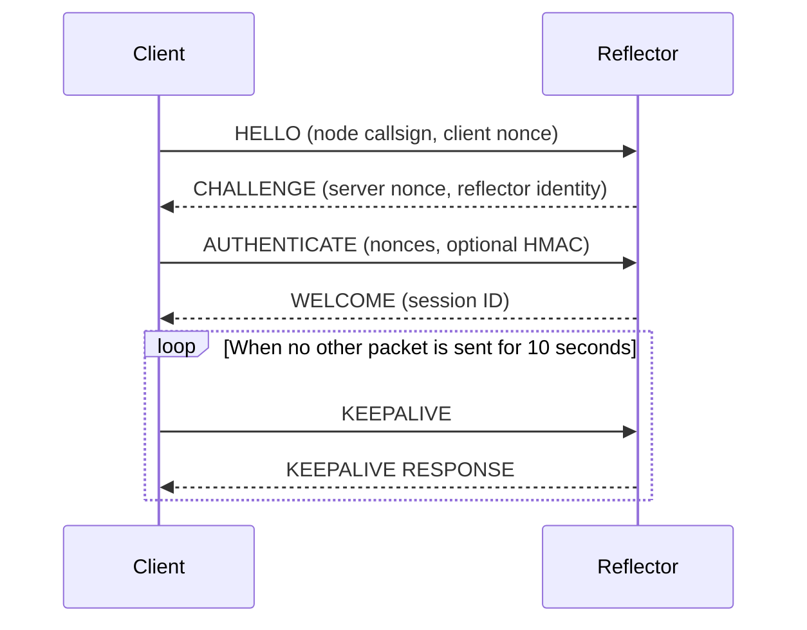
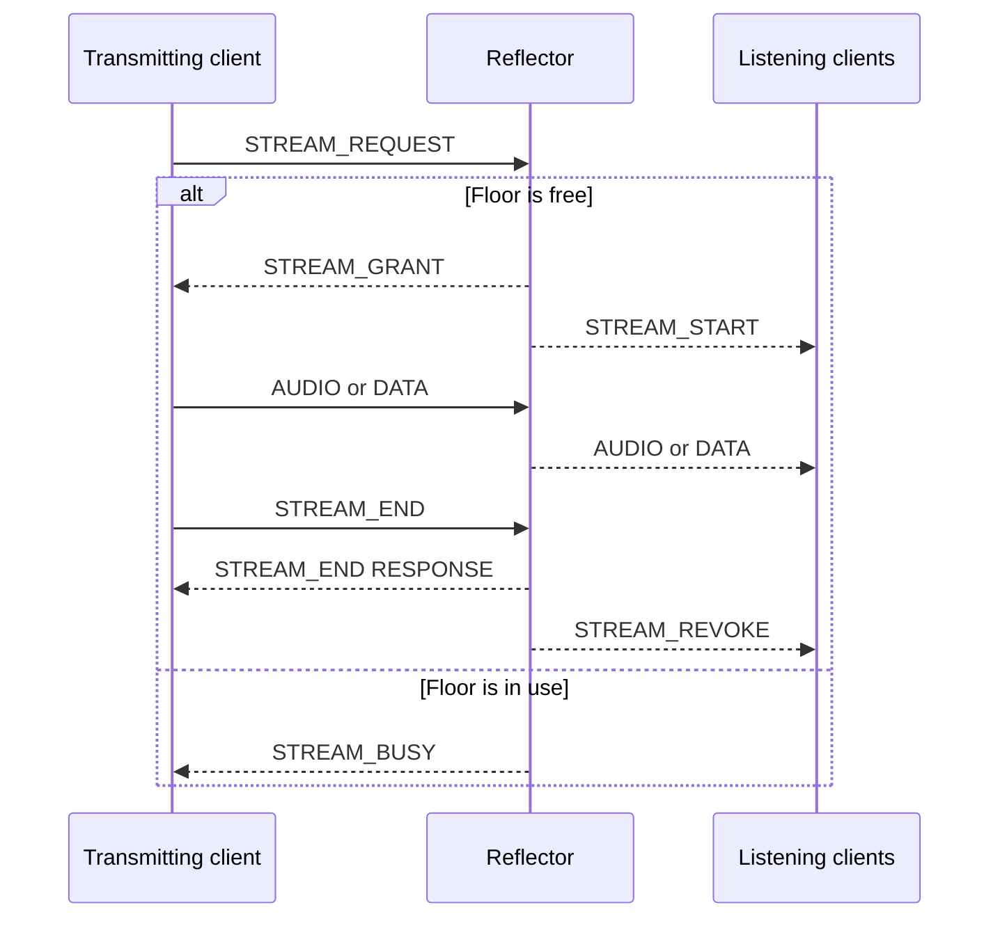

# OpusRef Wire Protocol Version 1

## 1. Purpose

This document specifies OpusRef version 1. OpusRef moves Opus audio packets and
typed data on an IP network. It does not specify a radio waveform.

The key words **MUST**, **MUST NOT**, **SHOULD**, **SHOULD NOT**, and **MAY** show
the requirement level.

## 2. Transport and byte order

OpusRef uses UDP. One UDP datagram contains one OpusRef packet. A packet MUST
not be more than 1,200 bytes. An implementation MUST NOT use IP fragmentation
to send a larger OpusRef packet.

All integer fields use network byte order. The protocol adds no CRC, FEC, or
per-packet MAC. UDP supplies transport checksum protection. Opus in-band FEC
MAY be present inside an audio payload.

## 3. Base header

Each packet starts with this 32-byte header.

| Offset | Size | Field | Requirement |
|---:|---:|---|---|
| 0 | 4 | Magic | ASCII `OPRF` |
| 4 | 1 | Version | `0x01` |
| 5 | 1 | Packet type | Section 6 |
| 6 | 2 | Flags | Section 3.1 |
| 8 | 2 | Header length | Base header plus TLVs |
| 10 | 2 | Payload length | Bytes after the complete header |
| 12 | 8 | Session ID | Random value from the server |
| 20 | 4 | Stream ID | Nonzero value from the transmitting client |
| 24 | 4 | Sequence | Stream packet sequence |
| 28 | 4 | Timestamp | 48 kHz media timestamp |

The header length MUST be from 32 through 1,200. It MUST be a multiple of four.
The datagram length MUST equal the header length plus the payload length. A
receiver MUST reject a packet that does not meet these rules.

A handshake packet before `WELCOME` uses session ID zero. A packet outside a
stream uses stream ID, sequence, and timestamp zero. Audio and data packets use
one shared sequence space for the stream. The first media packet uses sequence
zero. The value increases by one modulo 2^32 for each audio or data packet.

The first audio timestamp MAY have any value. Each later audio timestamp adds
the number of decoded samples in the prior Opus packet at a 48 kHz clock. A data
packet uses the timestamp of the current stream position.

### 3.1 Flags

| Bit | Name | Meaning |
|---:|---|---|
| 0 | RESPONSE | This packet is a response or acknowledgement. |
| 1 | RETRY | The sender retransmitted this transaction. |
| 2-15 | Reserved | The sender MUST set these bits to zero. |

A receiver MUST reject a packet with a nonzero reserved flag.

## 4. Header extensions

A TLV has a two-byte type, a two-byte value length, the value, and zero padding
to the next four-byte boundary. The value length excludes the TLV header and
padding. The receiver MUST verify that all padding bytes are zero.

Bit 15 of the TLV type is the critical bit. The lower 15 bits are the type
number. A receiver MUST reject an unknown critical TLV. It MUST skip an unknown
optional TLV. A packet MUST NOT contain the same TLV more than once unless this
document permits it.

| Type | Name | Value |
|---:|---|---|
| `0x0001` | Transaction ID | 8 random bytes |
| `0x0002` | Node callsign | 10 bytes |
| `0x0003` | Source callsign | 10 bytes |
| `0x0004` | Reflector ID | 16 bytes |
| `0x0005` | Display name | 1-64 bytes of UTF-8 |
| `0x0006` | Client nonce | 32 random bytes |
| `0x0007` | Server nonce | 32 random bytes |
| `0x0008` | Authentication tag | 32-byte HMAC-SHA-256 |
| `0x0009` | Data type | 2-byte unsigned integer |
| `0x000a` | Error code | 2-byte unsigned integer |
| `0x000b` | Error text | 1-128 bytes of UTF-8 |
| `0x000c` | Transmit time limit | 4-byte seconds value |
| `0x000d` | End reason | 2-byte unsigned integer |

A reflector ID uses uppercase ASCII, is left-aligned, and is padded with
spaces. Its permitted characters are the same as callsign characters.

## 5. Callsigns

A node callsign identifies a connected node. A source callsign identifies the
station that starts a stream. Each value is 10 bytes. It uses uppercase ASCII,
is left-aligned, and is padded with spaces. The unpadded value MUST contain one
through ten characters from `A-Z`, `0-9`, `/`, and `-`. The protocol does not
validate a callsign against a licensing database.

The server stores the node callsign in session state. `STREAM_REQUEST` supplies
the source callsign. Audio and data packets do not repeat callsigns.

## 6. Packet types

| Value | Name | Direction |
|---:|---|---|
| `0x01` | HELLO | Client to server |
| `0x02` | CHALLENGE | Server to client |
| `0x03` | AUTHENTICATE | Client to server |
| `0x04` | WELCOME | Server to client |
| `0x05` | KEEPALIVE | Both |
| `0x06` | DISCONNECT | Both |
| `0x07` | ERROR | Both |
| `0x20` | STREAM_REQUEST | Client to server |
| `0x21` | STREAM_GRANT | Server to requester |
| `0x22` | STREAM_BUSY | Server to requester |
| `0x23` | STREAM_START | Server to listeners |
| `0x24` | STREAM_END | Client request or server acknowledgement |
| `0x25` | STREAM_REVOKE | Server to clients |
| `0x40` | AUDIO | Floor owner to server; server to listeners |
| `0x41` | DATA | Floor owner to server; server to listeners |

Values `0x08-0x1f`, `0x26-0x3f`, and `0x42-0x7f` are reserved. Values
`0x80-0xff` are private experiments. A v1 server MUST NOT forward an unknown
packet type.

### 6.1 Packet field rules

The table lists all known TLVs that a packet can contain. `Required` TLVs MUST
occur one time. `Optional` TLVs MAY occur one time. A receiver MUST reject a
known TLV that is not permitted for the packet type. A receiver handles an
unknown TLV as specified in section 4.

`Zero` means that the field MUST be zero. `Session` means the connected client's
session ID. `Owner` means the floor owner's session ID. All control packets have
an empty payload.

| Packet | Session ID | Stream ID | Sequence and timestamp | Flags | Required TLVs | Optional TLVs | Payload |
|---|---|---|---|---|---|---|---|
| HELLO | Zero | Zero | Zero | RETRY on a retry only | Transaction ID, node callsign, client nonce | None | Empty |
| CHALLENGE | Zero | Zero | Zero | RESPONSE | Transaction ID, server nonce, reflector ID, display name | None | Empty |
| AUTHENTICATE | Zero | Zero | Zero | RETRY on a retry only | Transaction ID, client nonce, server nonce | Authentication tag in protected mode | Empty |
| WELCOME | New session | Zero | Zero | RESPONSE | Transaction ID, reflector ID, display name | None | Empty |
| KEEPALIVE request | Session | Zero | Zero | RETRY on a retry only | Transaction ID | None | Empty |
| KEEPALIVE response | Session | Zero | Zero | RESPONSE | Transaction ID | None | Empty |
| DISCONNECT request | Session | Zero | Zero | RETRY on a retry only | Transaction ID | None | Empty |
| DISCONNECT response | Session | Zero | Zero | RESPONSE | Transaction ID | None | Empty |
| ERROR | Session, or zero before admission | Related stream, or zero | Zero | RESPONSE | Error code | Transaction ID, error text | Empty |
| STREAM_REQUEST | Session | New stream | Zero | RETRY on a retry only | Transaction ID, source callsign | None | Empty |
| STREAM_GRANT | Session | Requested stream | Zero | RESPONSE | Transaction ID, transmit time limit | None | Empty |
| STREAM_BUSY | Session | Requested stream | Zero | RESPONSE | Transaction ID | None | Empty |
| STREAM_START | Owner | Active stream | Zero | Zero | Node callsign, source callsign, transmit time limit | None | Empty |
| STREAM_END request | Session | Active stream | Next sequence and current timestamp | RETRY on a retry only | Transaction ID | None | Empty |
| STREAM_END response | Session | Ended stream | Request values | RESPONSE | Transaction ID, end reason | None | Empty |
| STREAM_REVOKE | Owner | Ended stream | Next sequence and final timestamp | Zero | End reason | None | Empty |
| AUDIO | Owner | Active stream | Current media values | Zero | None | Future optional TLVs | One Opus packet |
| DATA | Owner | Active stream | Current media values | Zero | Data type | Future optional TLVs | Opaque data |

An audio or data payload MUST contain at least one byte. Header and TLV lengths
set its maximum size. A server-to-client `AUDIO` or `DATA` packet keeps the floor
owner's session ID. It does not replace that value with a listener's session ID.
The server still validates an inbound packet against the remote address that is
bound to the session. A listener MUST NOT use an observed owner session ID as
its local session ID.

## 7. Connection procedure



The client sends `HELLO` with a connection transaction ID, node callsign, and
client nonce. The server sends `CHALLENGE` with the same transaction ID, a server
nonce, the reflector ID, and the display name. A challenge expires after 10
seconds and is valid one time.

The client sends `AUTHENTICATE` with both nonces and the same connection
transaction ID.
In open mode, it omits the authentication tag. In protected mode, it includes
this HMAC-SHA-256 value:

```text
HMAC(shared-key,
     ASCII("OPRF-AUTH-V1") ||
     node-callsign[10] ||
     client-nonce[32] ||
     server-nonce[32] ||
     reflector-id[16])
```

The server compares the HMAC in constant time. It sends `WELCOME` with a random,
nonzero 64-bit session ID after successful admission. The session is bound to
the source IP address and UDP port. A client MUST complete a new handshake after
its address changes.

The client sends `KEEPALIVE` every 10 seconds when it sends no other packet.
The server returns the same transaction ID with `RESPONSE`. Any valid packet
refreshes session activity. The server expires a session after 30 seconds with
no valid packet.

## 8. Transactions and retries

A control request that expects a response MUST contain a transaction ID. The
client sends the first attempt at time zero. If no response arrives, it sends
three retries. The retries occur 500 ms, 1.5 seconds, and 3.5 seconds after the
first attempt. Thus, the delay after each attempt is 500 ms, 1 second, and 2
seconds. Each retry uses the same transaction ID and sets `RETRY`. The client
stops after four total attempts.

Before admission, the server cache key is the remote IP address and port, the
request packet type, and the transaction ID. After admission, the cache key is
the session ID, the request packet type, and the transaction ID. Packet type is
part of both keys. Thus, `HELLO` and `AUTHENTICATE` can use the same connection
transaction ID and cannot collide in the cache.

The server keeps a completed result for at least 30 seconds. When it receives a
duplicate request, it returns the prior logical result and does not repeat the
state change. A response copies the transaction ID and sets `RESPONSE`.

## 9. Half-duplex stream procedure



One server has one channel and one floor owner. A client sends `STREAM_REQUEST`
with a new nonzero stream ID, a transaction ID, and a source callsign. If the
floor is free, the server sends `STREAM_GRANT` to the requester. It also sends
`STREAM_START` with node callsign, source callsign, and transmit time limit to all
listeners. If the floor is not free, it sends `STREAM_BUSY`.

The client MUST wait for `STREAM_GRANT` before it sends media. The grant expires
if no media arrives in two seconds. The server releases the floor after one
second with no valid media. The default transmit time limit releases the floor
after 180 seconds. These three values are server configuration values.

The owner sends `STREAM_END` to release the floor. The server acknowledges it
with `STREAM_END` and `RESPONSE`, then sends `STREAM_REVOKE` to listeners. The
server also sends `STREAM_REVOKE` after a timeout or owner disconnect. The end
reason states why the server released the floor.

The server forwards only valid media from the floor owner's bound session and
stream ID. It forwards the original sequence, timestamp, TLVs, and payload. It
does not send media back to the owner. It drops media from all other clients.

A client that joins during a stream receives `WELCOME`, then the current
`STREAM_START`, then subsequent media. UDP can reorder these packets. A client
MUST discard media for a stream until it has the stream metadata.

## 10. Audio and data

An `AUDIO` payload is exactly one complete Opus packet. Version 1 permits mono
Opus only. The server MUST treat the payload as opaque bytes. It MUST NOT parse,
encode, decode, transcode, record, or modify the payload.

A `DATA` packet MUST contain one data-type TLV and an opaque payload. Data type
zero is invalid. Values `0x0001-0x7fff` are assigned by the public OpusRef
registry. Values `0x8000-0xffff` are private. Version 1 assigns no public
application data types.

Data is unreliable. It uses the active stream sequence space and arbitration.
The server MUST reject data outside the active stream.

## 11. Error handling

The end-reason values are: normal end (0), owner disconnect (1), grant timeout
(2), media inactivity (3), transmit time limit (4), and server shutdown (5).
An end reason is not an error code.

The defined error codes are: malformed packet (1), unsupported version (2),
authentication failed (3), invalid session (4), invalid stream (5), limit
exceeded (6), unsupported type (7), and internal error (8).

The server SHOULD silently drop an invalid unauthenticated packet. This rule
prevents reflection amplification. It MAY send a bounded `ERROR` for a valid
session. An error response MUST NOT be larger than the request.
