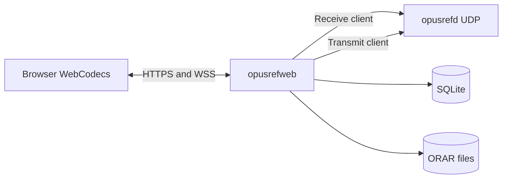
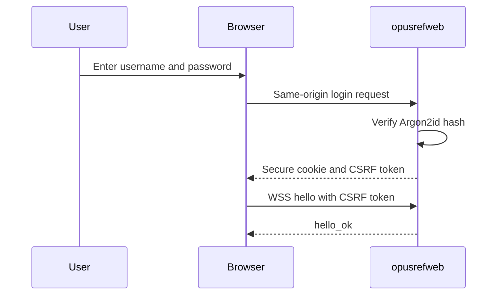

# OpusRef web console

This document specifies the first OpusRef web companion implementation. Issue 3
is the product specification. The UDP protocol in `protocol-v1.md` stays
unchanged.

## Process boundary

`opusrefweb` is a separate process. It uses two ordinary OpusRef UDP clients. One
client receives audio. One client requests the floor and sends browser audio.
The process does not encode or decode Opus. The browser uses WebCodecs.

## Security

Put an HTTPS reverse proxy in front of the public listener. Preserve the exact
Origin header for WebSocket upgrades. Do not publish the monitor listener. The
public listener does not serve `/metrics`.

The server stores Argon2id password hashes. It stores hashes of session, CSRF,
and reauthentication tokens. It sends a session token only in the secure
`__Host-opusref_session` cookie. An administrator must create each account.

## Media

Each ORWB binary message contains one complete Opus packet. The server accepts
1 through 1,168 payload bytes. The server copies payload bytes without a codec
operation. A PTT channel starts at sequence 0 and timestamp 0. Each browser
packet adds 1 to the sequence and 960 to the timestamp.

The ORAR archive stores the OpusRef sequence, 48 kHz timestamp, arrival offset,
and unchanged payload. A final file has the `.orar` suffix. An open recovery file
has the `.partial` suffix. The archive directory must have mode `0700`. Files
must have mode `0600`.

## Start the service

1. Copy `opusrefweb.example.yaml` to an operator-controlled path.
2. Set the final HTTPS origin and WebAuthn RP ID.
3. Create the storage directory with mode `0700`.
4. Run `opusrefweb auth benchmark --config FILE`.
5. Run `opusrefweb admin create --config FILE --username NAME` on a TTY.
6. Start `opusrefd`.
7. Start `opusrefweb serve --config FILE`.

The service refuses readiness when no enabled administrator exists. Stop the
service with SIGTERM. The process removes readiness before it closes the HTTP
listeners and reflector clients.

## Current implementation limit

The first backend implementation supplies the protocol and storage foundations.
The implementation review must reject the release until all Issue 3 routes,
passkey ceremonies, archive recovery, retention, playback, reconnect behavior,
and operator metrics pass their acceptance tests.
