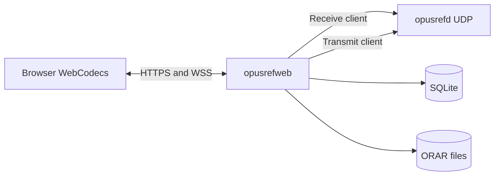
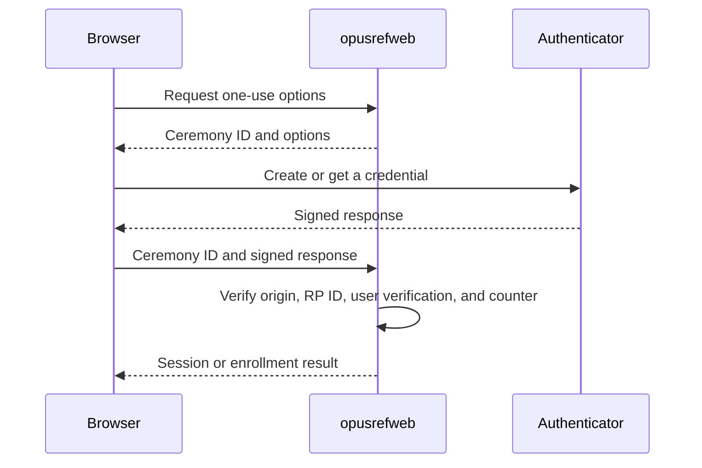
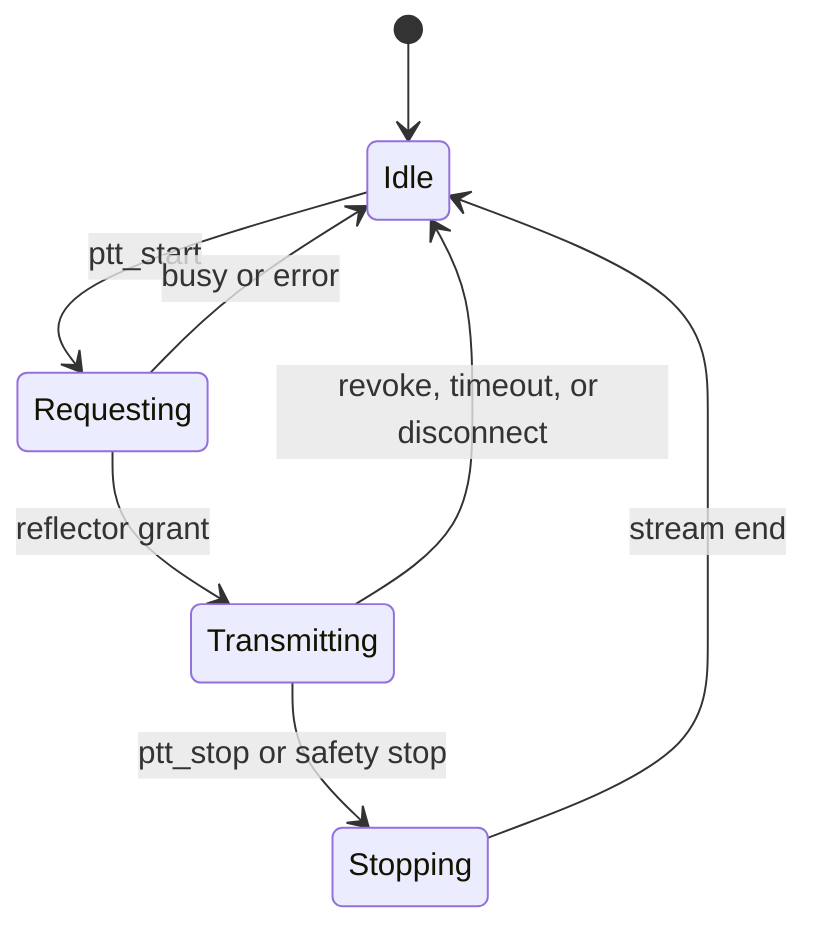
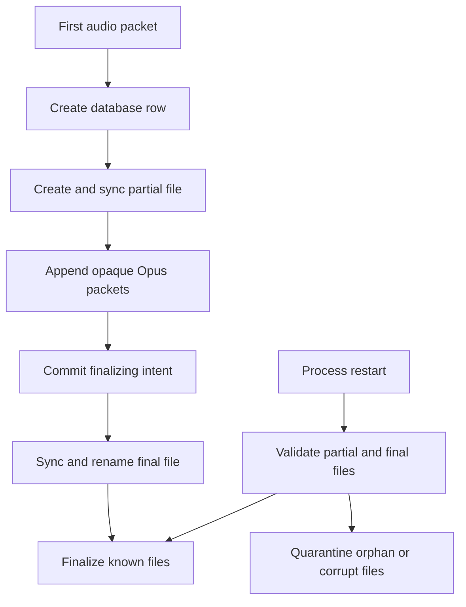
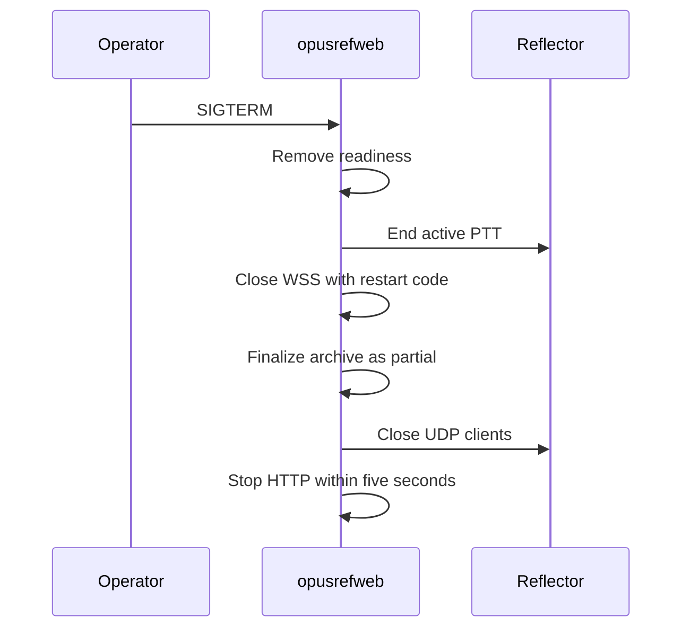

# OpusRef web console

This document specifies the first OpusRef web companion implementation. Issue 3
is the product specification. The UDP protocol in `protocol-v1.md` stays
unchanged.

## Process boundary

`opusrefweb` is a separate process. It uses two ordinary OpusRef UDP clients. One
client receives audio. One client requests the floor and sends browser audio.
The process does not encode or decode Opus. The browser uses WebCodecs.

## Security

Put an HTTPS reverse proxy in front of the public listener. Preserve the exact
Origin header for WebSocket upgrades. Do not publish the monitor listener. The
public listener does not serve `/metrics`.

The server stores Argon2id password hashes. It stores hashes of session, CSRF,
and reauthentication tokens. It sends a session token only in the secure
`__Host-opusref_session` cookie. An administrator must create each account.

```mermaid
sequenceDiagram
    participant U as User
    participant B as Browser
    participant W as opusrefweb
    U->>B: Enter username and password
    B->>W: Same-origin login request
    W->>W: Verify Argon2id hash
    W-->>B: Secure cookie and CSRF token
    B->>W: WSS hello with CSRF token
    W-->>B: hello_ok
```

## Media

Each ORWB binary message contains one complete Opus packet. The server accepts
1 through 1,168 payload bytes. The server copies payload bytes without a codec
operation. A PTT channel starts at sequence 0 and timestamp 0. Each browser
packet adds 1 to the sequence and 960 to the timestamp.

The ORAR archive stores the OpusRef sequence, 48 kHz timestamp, arrival offset,
and unchanged payload. A final file has the `.orar` suffix. An open recovery file
has the `.partial` suffix. The archive directory must have mode `0700`. Files
must have mode `0600`.

## Start the service

1. Copy `opusrefweb.example.yaml` to an operator-controlled path.
2. Set the final HTTPS origin and WebAuthn RP ID.
3. Optionally configure `password_blocklist_file` with site-specific additions.
   The service always applies its pinned, embedded SecLists 10k corpus first.
4. Create the storage directory with mode `0700`.
5. Run `opusrefweb auth benchmark --config FILE`.
6. Run `opusrefweb admin create --config FILE --username NAME` on a TTY.
7. Start `opusrefd`.
8. Start `opusrefweb serve --config FILE`.

The service refuses readiness when no enabled administrator exists. Stop the
service with SIGTERM. The process removes readiness before it closes the HTTP
listeners and reflector clients.

Readiness is a cached dependency state shared by `/readyz`, public status, and
WebSocket `hello_ok`. A bounded background worker probes archive storage. Public
requests do not perform file creation or `fsync`. During shutdown, the service
rejects new work, stops PTT, closes WebSockets with 4410, finalizes the archive,
closes both reflector clients, and then closes HTTP within one five-second
grace period.

The monitor listener exports fixed-cardinality HTTP, WebSocket, audio, queue,
PTT, authentication, archive, playback, database, reconnect, and audit metric
families. Callsigns and account identifiers are not metric labels. An
administrator can read the newest 256 redacted operational alerts from
`GET /api/v1/admin/events`; older entries are discarded in memory.

The receive client and transmit client reconnect with a bounded exponential
delay. Readiness is false unless both clients have authenticated reflector
sessions. A reconnect does not change the browser API. A reflector revoke ends
the active browser PTT channel.

The WebSocket writer uses separate bounded control, live-audio, and playback
queues. Control output has priority. A full live queue drops its queued media
and announces a discontinuity with a new channel. A full playback queue pauses
playback for an explicit resume or seek. A full control queue closes the socket
with code 4409. One slow browser cannot block the reflector clients.

Each playback queue item has a server generation. Pause, seek, close, and
session revocation retire the current generation and discard its queued media.
The writer rejects retired media that it already removed from the queue. A
pause or seek result is a media barrier. Resume keeps the sequence of the same
channel. Seek starts a new sequence at zero.

Authentication limits use bounded in-memory token buckets. Passkey begin and
finish operations share source and account buckets. Administrator mutations
share one administrator-session bucket. Limiter state expires after 30 minutes.
Each operation category has separate limiter capacity. A rejected source does
not allocate new username state. One operation category cannot exhaust another
category.
Audit records use fixed action and outcome values. Audit details do not contain
submitted credentials, tokens, addresses, or media.

One recording has a hard 256 MiB limit. The service finalizes that recording as
partial when it reaches the limit. This limit does not stop other recordings.
The global archive quota stops new recordings until an administrator deletes
enough archive data. The startup alert buffer retains at most 256 entries. It
retains an overflow alert when it drops recovery alerts.

## Passkey flow

## PTT flow

## Recording recovery

Each queued archive item includes the reflector session ID and stream ID. The
archive worker accepts an item only for the active stream. `STREAM_END` drains
all earlier media before it finalizes the file. A sequence gap, a synthetic end,
an unknown prefix, or archive backpressure makes the recording `partial`.

Recording IDs are canonical UUID strings. File access stays in the configured
archive directory. Playback uses a bounded sparse index and reads packets on
demand. It does not reject a recording because the recording has many packets.
Deletion uses the database `deleting` state and a `.deleting` file. Startup
completes an interrupted deletion. Retention removes expired recordings first.
Quota-full mode stops new archive writes and keeps retained recordings. The
service stays ready and reports degraded recording state. Retention cleanup is
the only automatic operation that deletes recordings.

Finalization stores the first and last sequence and timestamp in the same
database update as the final status. Startup recovery reconstructs these
values. Quota refusal and recovery anomalies raise fixed metrics and bounded
operator events. The service replays startup anomalies after it attaches the
observer.

## API pagination

`GET /api/v1/recordings` accepts `limit`, `cursor`, `callsign`, `status`,
`from`, and `to`. The limit range is 1 through 200. The cursor is opaque. The
result contains `items` and can contain `next_cursor`. Use
`GET /api/v1/recordings/{id}` for one recording.

Passkey option results contain `ceremony_id` and `publicKey` at the same level.
Passkey reauthentication uses `/api/v1/me/reauth/passkey/options` and
`/api/v1/me/reauth/passkey/verify`. A successful verification returns a one-use
reauthentication token that expires after five minutes.

## Shutdown

