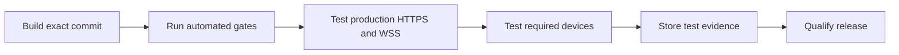

# Browser qualification

Use this checklist before you qualify a web console release. Automated browser
tests do not replace the device tests in this document.

## Automated evidence

Run these commands from `web` on a clean checkout:

```text
npm ci
npm run typecheck
npm test
npm run build
npm run check:dist
npm run test:e2e
npm audit --audit-level=high
```

The tests verify the production WebCodecs worker in Chromium. They also verify a
virtual passkey, loopback WebSocket control and media, and the production bundle
over a local HTTPS and same-origin WSS connection. Playwright WebKit does not
qualify Safari. A local test certificate does not qualify the production proxy.

## Production and device tests

Test the exact release commit. Record the date, commit SHA, device model, OS,
browser version, operator, result, and evidence location for each row.

| Test target | Required checks | Result and evidence |
| --- | --- | --- |
| Production reverse proxy | Valid public certificate; HTTPS; same-origin WSS; CSP and security headers; WSS compression disabled; login; session revocation; slow-client close | Not tested |
| Safari 26 on macOS | Capability screen; live listen; playback and seek; hold and latch PTT; microphone denial; BUSY; TOT; hidden page and page exit | Not tested |
| Safari 26 on iOS | Same checks as macOS; screen lock; app switch; network change | Not tested |
| Chrome on Android | Same checks as iOS; Bluetooth and handset audio routes | Not tested |

For every audio test, verify that the channel ID, source callsign, sequence,
timestamp, and recording status remain correct. Verify recovery after a WSS restart.
Verify that the UI does not restart audio without a user action.



Do not mark the release as browser-qualified until every row has a passing result
and an evidence location.
