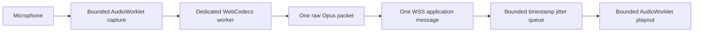

# OpusRef web frontend

This directory contains the Vue 3 browser client for `opusrefweb`. The Go
companion serves the committed `dist` directory. Production deployment does not
need Node.js.

## Development

Use Node.js 22. Install the exact dependencies and run the checks:

```text
npm ci
npm run typecheck
npm test
npm run build
npm run check:dist
npm run test:e2e
npm run test:system-proxy
```

The browser never sends or receives an audio container. Each ORWB binary message
contains one complete raw Opus packet. The browser does all Opus encoding and
decoding in a dedicated WebCodecs worker. The Go service does not use a codec.

Every JSON `channel_id` is a canonical unsigned decimal string. The browser
validates the string before it converts the value to `BigInt`. This rule preserves
all 64 bits. The binary ORWB header stores the same value as a network-order
unsigned 64-bit integer.



The worker waits for 60 ms of contiguous decoded PCM. It unwraps the 48 kHz
timestamp and paces output from that clock. It stores no more than 500 ms or 1 MiB
of decoded data. It drops expired PCM. It inserts at most 120 ms of silence for a
positive gap. It resets after a timestamp jump greater than two seconds. A seek or
discontinuity clears decoder, jitter, and playout state.

Pause, resume, seek, close, and server pause results create a browser playout
barrier. The browser tags decoder output and AudioWorklet input with a local
generation. It rejects output from a retired generation. Pause and resume keep the
server sequence continuous. While a pause request is pending, the browser checks
and advances same-channel sequence values but does not decode the packets. The
pause result stops this sequence accounting. A correlated seek starts a new
sequence at zero.

The capture port has four credits. The encoder queue has four entries. The browser
stops PTT when a capture, encoder, or WebSocket queue reaches its limit. The playout
worklet uses a fixed 500 ms ring buffer. It does not use an unbounded media array.

Audio requires raw Opus support, a 48 kHz `AudioContext`, `AudioWorklet`, and
WebCodecs audio encoder and decoder support. The UI keeps monitoring and account
functions available when the capability test fails.

The worker tests the complete encoder configuration before it starts audio. A
Chromium browser test runs the production worker. It encodes three packets, checks
sequence and timestamp values, checks the payload limits, and decodes the packets.
The test does not qualify a release on Safari or an Android device.

The browser closes privileged media when the page becomes hidden. It also closes
privileged media for every `pagehide` event. If a session becomes invalid in open
access mode, the browser stops PTT and playback. It keeps anonymous live listening
available. If the WebSocket closes, the UI requires the user to select Listen live
again. It does not restart audio without a user action.

The audio start operation waits for the WebSocket hello response. A connection
failure does not disable playback. The recording page keeps a Retry playback
control available. A device capability failure disables playback and explains the
unsupported capability.

An account with a temporary password can use only the Security page and the sign
out control. The page explains how to change the password. The main navigation
shows the other authenticated pages after the password change succeeds.

The Operations page gets the bounded operator event list from
`/api/v1/admin/events`. It shows severity, time, type, and redacted operator text.
It has separate loading, empty, and error states. The Accounts page uses cards on
small screens so that each account action stays visible.

Latch PTT is off by default. Hold mode stops when the user releases the control.
Latch mode stops after the user activates the control a second time. The UI shows
these instructions and announces each latch state change. Passkey removal requires
confirmation and identifies the passkey.

Playwright uses loopback servers to test control messages, ORWB media, playback,
close handling, anonymous downgrade, and the production bundle over HTTPS and
same-origin WSS. The local HTTPS certificate is test-only. The system release gate
must also test the configured reverse proxy and the devices in
[QUALIFICATION.md](QUALIFICATION.md).

The system proxy test starts the Go reflector, Go companion, and nginx. It uses
native nginx when available and a pinned nginx container otherwise. It requires
OpenSSL and either nginx or Docker.

## Production assets

Run `npm run build`. Commit the resulting `dist` directory with the source and
lock file. CI rebuilds the directory and checks for a clean Git worktree.

Playwright WebKit is a regression target. It does not qualify Safari support.
Release qualification must test real Safari 26 on macOS and iOS. It must also
test Chrome on Android.
