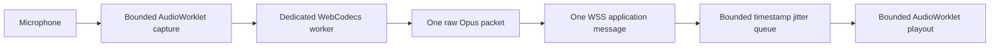

# OpusRef web frontend

This directory contains the Vue 3 browser client for `opusrefweb`. The Go
companion serves the committed `dist` directory. Production deployment does not
need Node.js.

## Development

Use Node.js 22. Install the exact dependencies and run the checks:

```text
npm ci
npm run typecheck
npm test
npm run build
npm run check:dist
npm run test:e2e
```

The browser never sends or receives an audio container. Each ORWB binary message
contains one complete raw Opus packet. The browser does all Opus encoding and
decoding in a dedicated WebCodecs worker. The Go service does not use a codec.

Every JSON `channel_id` is a canonical unsigned decimal string. The browser
validates the string before it converts the value to `BigInt`. This rule preserves
all 64 bits. The binary ORWB header stores the same value as a network-order
unsigned 64-bit integer.



The worker waits for 60 ms of contiguous decoded PCM. It unwraps the 48 kHz
timestamp and paces output from that clock. It stores no more than 500 ms or 1 MiB
of decoded data. It drops expired PCM. It inserts at most 120 ms of silence for a
positive gap. It resets after a timestamp jump greater than two seconds. A seek or
discontinuity clears decoder, jitter, and playout state.

The capture port has four credits. The encoder queue has four entries. The browser
stops PTT when a capture, encoder, or WebSocket queue reaches its limit. The playout
worklet uses a fixed 500 ms ring buffer. It does not use an unbounded media array.

Audio requires raw Opus support, a 48 kHz `AudioContext`, `AudioWorklet`, and
WebCodecs audio encoder and decoder support. The UI keeps monitoring and account
functions available when the capability test fails.

## Production assets

Run `npm run build`. Commit the resulting `dist` directory with the source and
lock file. CI rebuilds the directory and checks for a clean Git worktree.

Playwright WebKit is a regression target. It does not qualify Safari support.
Release qualification must test real Safari 26 on macOS and iOS. It must also
test Chrome on Android.
